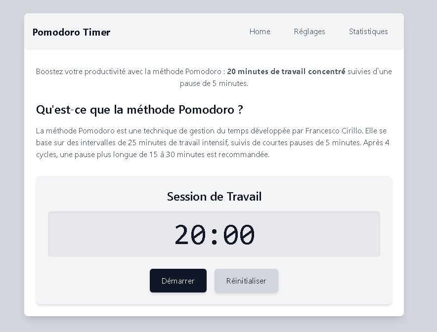
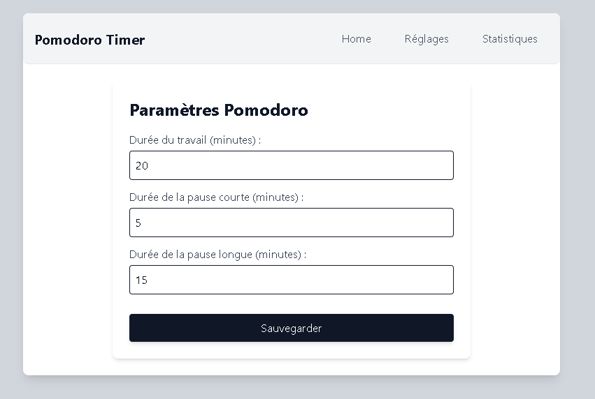

# 🚀 **React + Vite** – Minimal Setup with HMR & ESLint 🚀

<div align="center">
  
</div>

---

## 📝 **Overview**

This template provides a **minimal setup** to get **React** running with **Vite**, featuring:

- ⚡ **Hot Module Replacement (HMR)** for seamless development
- 🧹 **ESLint rules** for consistent code quality

🔌 **Available official plugins:**

- 🧬 [@vitejs/plugin-react](https://github.com/vitejs/vite-plugin-react/blob/main/packages/plugin-react/README.md): Uses [Babel](https://babeljs.io/) for Fast Refresh
- 🦀 [@vitejs/plugin-react-swc](https://github.com/vitejs/vite-plugin-react-swc): Uses [SWC](https://swc.rs/) for Fast Refresh

---

## ⚙️ **Configuration**

### ⏲️ **Timer Settings**

Customize the default timer settings directly from the **Settings** page:

<div align="center">
  
</div>

---

### 💾 **Local Storage**

The application uses **localStorage** to persist:

- ⏱️ Timer settings
- 📊 Statistics data
- ⚙️ User preferences

---

## 🛠️ **Development**

### 🚀 **Available Scripts**

| Command           | Description                 |
| ----------------- | --------------------------- |
| `npm run dev`     | 🏗️ Start development server |
| `npm run build`   | 🏢 Build for production     |
| `npm run preview` | 🔍 Preview production build |
| `npm run lint`    | 🧹 Run ESLint               |

---

### 🧹 **Code Style**

This project follows **ESLint** standards with:

- ✅ React recommended rules
- 🔄 React Hooks best practices
- 📝 Custom project-specific rules

---

## 🤝 **Contributing**

1. 🍴 Fork the repository
2. 🌱 Create your feature branch:
   ```bash
   git checkout -b feature/AmazingFeature
   ```
3. ✅ Commit your changes:
   ```bash
   git commit -m 'Add some AmazingFeature'
   ```
4. 🚀 Push to the branch:
   ```bash
   git push origin feature/AmazingFeature
   ```
5. 📩 Open a Pull Request

---

## 📜 **License**

🔑 This project is licensed under the **MIT License**. See the [LICENSE](LICENSE) file for details.

---

## 🙏 **Acknowledgments**

- 🍅 [Pomodoro Technique](https://en.wikipedia.org/wiki/Pomodoro_Technique) by Francesco Cirillo
- 📘 [React Documentation](https://reactjs.org/)
- ⚡ [Vite Documentation](https://vitejs.dev/)
- 🎨 [Tailwind CSS](https://tailwindcss.com/)

---

## 📞 **Contact**

👤 **Michel D**  
🔗 **Project Link:** _none for the moment_

---

## 🖼️ **Screenshots**

### 🏠 **Home Page**

<div align="center">
  
</div>

---

### 📊 **Settings View**

<div align="center">
  
</div>

---

### ⚙️ **Statistics Panel**

<div align="center">
  
</div>

---

<div align="center">
  🚀 *Code faster. Build smarter. Stay productive!* 🌟
</div>
